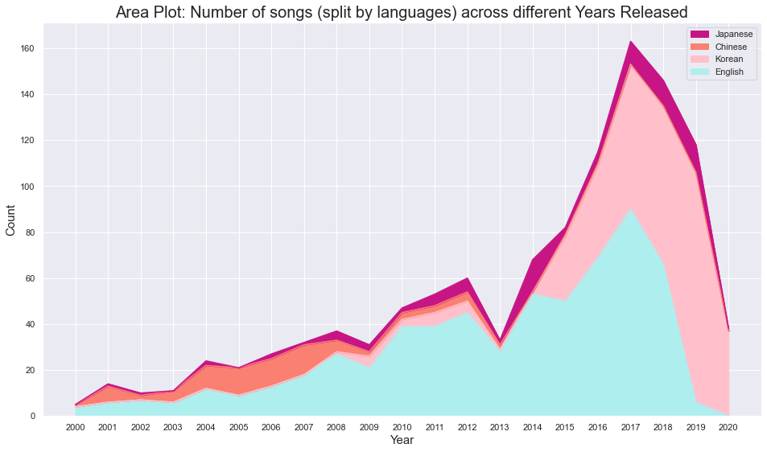
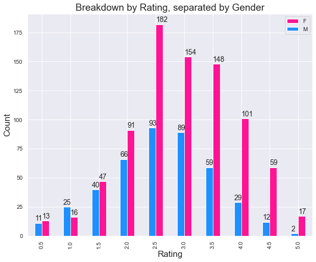

# An Analysis of My Music Library
*Last Updated: 08 Jul 2020*

This is just a side project where I do data analysis of my library for fun - some number crunching and a whole lot of visuals. This is still a work in progress, but I think I have exhausted much of the "dimensionality" of my dataset for now. Through this, I have come to recognise certain bias and leanings that I have in my music.

Anyways, for now, this analysis is largely static. In the sense that the analysis this notebook provides is limited towards capturing an instantaneous point in time of my library's contents - i.e. a snapshot. Ideally, this could be expanded to track how my library has evolved as time progressed, but for now I am putting a pin on that. A job for future me.

Note that for my music library, I have omitted the song titles as well as their albums. I don't want people to know exactly what I am jamming to. (I guess I would feel weirded out by that?) But nevertheless, the remainder of the data that I choose to reveal (in this notebook/repo) can paint a more-or-less clear picture of what I kind of songs I like to listen to. :)

As an example, here's a couple of graphs that I conjured (they are outdated, but the idea is more or less the same):

One last thing for the people who have read this far: The genres that I have labelled for a variety of songs are pretty weird, I admit. A number of these are placeholder genres labels, and I have not gotten around to assigning them "proper" ones yet. Genres are a highly subjective thing anyway - people can disagree on what genre/s a song belongs in, especially when you throw in how music lovers can have varying views of how important it is to represent subgenres too. I just have a personalised way of "generification" my entire library that defies conventional assignments, but it has not been realised yet. I am still working out the kinks as I go along. It might take forever for me to accomplish my "ideal form" of genres assignment, but I don't mind working on it. I don't see it as a chore - this is like a hobby to me!

